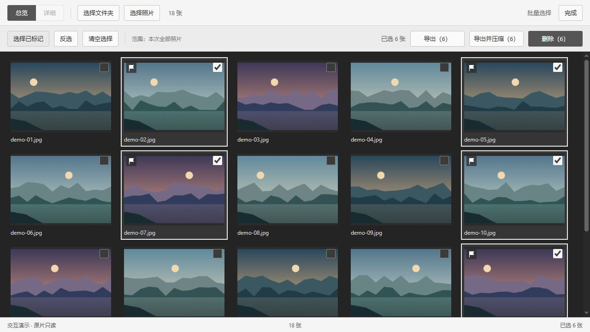
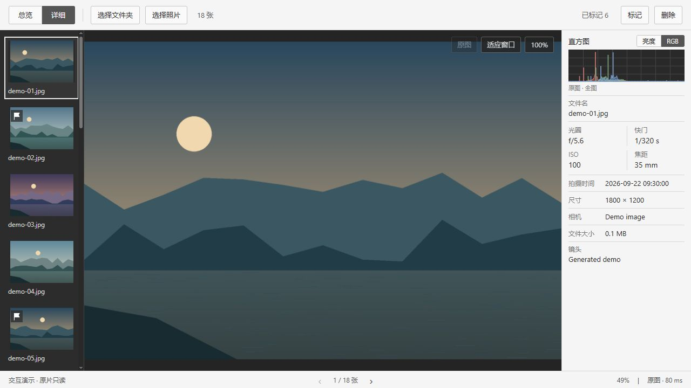

<div align="center">

# NBPhotoViewer

**快速浏览，专注选片。**

一款运行在 Windows 本地的照片浏览与选片工具，支持常见图片及多品牌相机 RAW。


[功能](#功能) · [开始使用](#开始使用) · [操作指南](#操作指南) · [从源码运行](#从源码运行) · [更新记录](CHANGELOG.md)

</div>

## 功能

| | |
| :--- | :--- |
| **快速浏览** | RAW 内嵌预览优先、相邻照片预加载、缩略图与图像缓存 |
| **两种视图** | 总览网格快速选片；详情页集中展示照片、缩略图、直方图与拍摄参数 |
| **检查细节** | 100% 查看、鼠标中心缩放、拖动平移，连续翻图保留倍率与查看位置 |
| **标记与筛选** | 一键标记照片，随时只看已标记照片，重启后保留标记 |
| **批量操作** | 单击多选、Shift 连选、拖动连选，支持选择已标记、反选、导出与删除 |
| **本地导出** | 复制图片、另存为 JPEG；批量导出独立 JPEG，或导出并压缩为 ZIP，自动按大小分包 |

## 界面预览

**总览 · 标记与批量选择**



**详情 · 大图、直方图与拍摄参数**



## 支持的格式

| 类型 | 扩展名 |
| :--- | :--- |
| 常见图片 | JPG / JPEG、PNG、WebP、TIF / TIFF、BMP、GIF |
| 尼康 | NEF、NRW |
| 佳能 | CR2、CR3、CRW |
| 索尼 | ARW、SR2、SRF |
| 富士 | RAF |
| 通用 RAW | DNG |
| 其他相机 RAW | ORF、RW2、PEF、SRW、RWL、3FR、FFF、IIQ、KDC、DCR、MOS、MRW、X3F |

RAW 的实际兼容性取决于机型及压缩方式。HEIC / HEIF、AVIF 暂不支持；动画和多页图片按第一帧或第一页浏览。照片有 EXIF 时显示拍摄参数，缺失字段显示“—”。

## 开始使用

1. 运行构建好的 `NBPhotoViewer.exe`。使用程序无需安装 Node.js、Rust 或 Python，电脑需具备 WebView2 Runtime。
2. 点击 **选择文件夹**，或点击 **选择照片** 多选文件。文件夹只读取当前层，不递归扫描子文件夹。
3. 在总览中浏览、标记照片；双击照片进入详情，检查构图和对焦。
4. 返回总览，点击 **批量选择**，选择需要导出或删除的照片。

顶部按钮可随时更换照片来源。每次启动重新选择来源，已有照片标记会自动恢复。

## 操作指南

### 浏览与查看

| 操作 | 效果 |
| :--- | :--- |
| 总览中双击照片 | 进入详情 |
| `Enter` | 切换总览 / 详情 |
| `←` / `→` 或底部箭头 | 上一张 / 下一张 |
| 鼠标滚轮 | 以鼠标位置为中心缩放 |
| 详情中按住鼠标拖动 | 平移照片 |
| `Space` 或双击大图 | 切换适应窗口 / 100% |
| `F` | 标记 / 取消标记当前照片 |
| `Delete` | 打开删除确认框 |

### 批量选择

点击 **批量选择** 后才显示勾选框和批量操作栏。标记与勾选是独立状态，清空勾选不会取消照片标记。

| 操作 | 效果 |
| :--- | :--- |
| 单击照片或勾选框 | 追加选中；再次单击取消该张，保留其他选择 |
| `Ctrl` + 单击 | 追加 / 取消单张 |
| `Shift` + 单击 | 选中起点到当前照片之间的整段，替换当前勾选 |
| `Ctrl` + `Shift` + 单击 | 在已有勾选上追加整段 |
| 从一张照片按住拖到另一张后松开 | 追加选中两端及其间的照片，支持反向拖动和边缘自动滚动 |
| 拖动时按 `Esc` | 取消本次拖动 |
| 选择已标记 | 选中本次来源中的全部已标记照片 |
| 反选 | 翻转本次全部照片的勾选状态，包括屏幕外照片 |
| 清空选择 / 完成 | 清空勾选 / 退出批量模式 |

**导出（N）**、**导出并压缩（N）** 与 **删除（N）** 中的数量跟随当前选择变化。删除前会展示已选总数，以及其中已标记、未标记照片的数量；失败项会保留并显示原因。

## 导出与本地数据

- 详情页右键可复制整张图片，或将图片另存为 JPEG；导出结果不会插入当前浏览列表。
- **导出（N）**：将所选照片分别保存为 JPEG，直接写入指定文件夹。
- **导出并压缩（N）**：在 Windows“另存为”窗口中选择目录并输入名称。例如输入“北京旅游”，生成 `北京旅游-001.zip`、`北京旅游-002.zip`。每个 ZIP 严格小于 **1 GB（1,000,000,000 字节）**，照片较多时自动分包。
- 本次运行记住上次 ZIP 导出的目录和名称，同一名称在分包、后续导出或切换目录时连续编号；改用新名称从 `001` 开始，再切回旧名称会接着编号。关闭程序后清除记忆，已有文件始终跳号避让。
- 导出支持进度显示与取消，同名输出自动加序号，不覆盖原片及已有输出文件。
- 标记保存在 `%LOCALAPPDATA%\NBPhotoViewer\library.sqlite3`，不写入原片；`previews` 目录存放可重新生成的预览缓存。
- 首次升级到 v1.0.0 时会自动导入旧版标记，保留旧数据库。缩略图缓存按需重新生成。

## 关于预览

RAW 优先读取相机内嵌预览；支持显影的文件可切换到 RAW 显影。**100% 指当前显示图像的实际像素**，内嵌预览的尺寸可能小于 RAW 原始分辨率。

直方图根据整张显示图像计算，支持亮度和 RGB，不随缩放或平移改变统计范围。默认线性显示，点击图表或下方说明文字即可在线性和平方根之间切换，文字同步显示当前方式。切换只重绘已有统计，不重新读取照片；两种方式均完整显示峰值、不截顶，RGB 三通道共用同一最大值。平方根显示可让低柱更容易看清，此时柱高不代表像素数量的线性比例。首次显影、超大文件及特殊压缩格式的加载时间取决于硬件和文件情况。

## 从源码运行

技术栈：**Tauri 2 + React + TypeScript + Rust**。RAW 解码使用 LibRaw，标记使用 SQLite 存储，Windows WIC 和 libwebp 用于部分格式的缩略图加速。

开发环境：Node.js 24、Rust stable（MSVC）、Visual Studio Build Tools 的“使用 C++ 的桌面开发”组件，以及 WebView2 Runtime。可使用 IDEA 或 VS Code 打开项目。

```powershell
npm ci
npm run tauri dev
```

构建独立可执行文件：

```powershell
npm run build
cargo build --release --bin NBPhotoViewer --features custom-protocol
```

产物：`target\release\NBPhotoViewer.exe`。`custom-protocol` 用于在可执行文件中嵌入前端资源。

若环境限制构建工具创建子进程，可用以下命令替代 `npm run build`：

```powershell
node node_modules/typescript/bin/tsc --noEmit
node scripts/build.mjs
```

运行内置单元测试：

```powershell
cargo test --release --lib
```

`nbphoto-bench` 是开发诊断工具，提供 `inspect`、`bench`、`serve`、`export`（ZIP）和 `export-jpegs`（独立 JPEG）子命令。`serve` 只监听本机且接口只读，正式桌面应用无需启动该服务。开发测试可用 `NBPHOTOVIEWER_DATA_DIR` 指定独立数据目录。

## 第三方组件

| 组件 | 许可与源码 |
| :--- | :--- |
| LibRaw 0.22.2 | [源码](vendor/LibRaw-0.22.2) · [LGPL 2.1](vendor/LibRaw-0.22.2/LICENSE.LGPL) / [CDDL](vendor/LibRaw-0.22.2/LICENSE.CDDL) |
| libwebp 1.6.0 | [源码](vendor/libwebp-1.6.0) · [BSD 许可](vendor/libwebp-1.6.0/COPYING) · [专利授权](vendor/libwebp-1.6.0/PATENTS) |

其他依赖的许可见各自包内说明。历史功能变更见 [CHANGELOG](CHANGELOG.md)。
